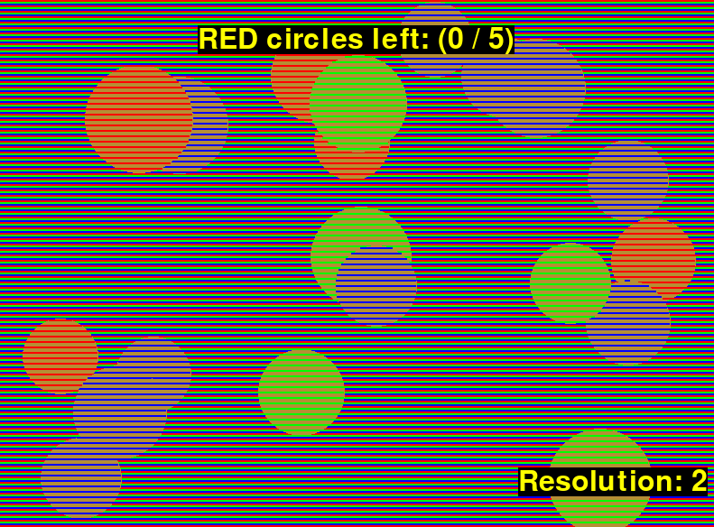

# 85-211 EAC (Extension Application Creative) project
## Gustavo Silvera
### CMU Psychology F22

# Optical Illusions Minigame

Welcome to Gustavo's 85-211 E/A/C Fall 2022 project: Optical Illusions Minigame
**Game**: This optical illusion minigame has you play through a game for catching (clicking) circles of various (randomized) colours. Your aim is to catch all the circles of a specific colour in the least number of clicks, so make sure you can interpret the colours correctly! Remember that two (or more) overlapping circles can save you a click!

**Illusion**: If you look closely, all the circles are actually the same colour! There is an illusion based off which rows are rendered over each circle that skews our perception of colour (especially in motion!) and make it seem like the circles are coloured differently. I first saw this illusion from [here](https://www.syfy.com/syfy-wire/another-brain-frying-optical-illusion-what-color-are-these-spheres). This effect is strongest with the thinnest (and most frequent) rows, you can change this parameter (resolution) at runtime to see this effect for yourself!

# Installation
**NOTE** You can actually demo this game entirely in your browser [here](https://trinket.io/features/pygame)! Just paste everything from `illusion.py` into the `main.py` pane and click `RUN`

The only dependency for this application is `python3` ([https://www.python.org/downloads/](https://www.python.org/downloads/)) and `pygame` ([https://www.pygame.org](https://www.pygame.org)).

Once `python3` is installed, you can install `pygame` with:
```bash
pip install pygame
```

# Running the game
```bash
python3 illusion.py
```



You'll get the following output from the terminal where you launch the game and play through it.
```txt
pygame 2.1.2 (SDL 2.0.18, Python 3.8.13)
Hello from the pygame community. https://www.pygame.org/contribute.html
Welcome to v1.0 of Gustavo's illusion game!

Controls:
 -- Click on a circle to reveal its true colours!
 -- Up/Down arrows to change the "resolution"
 -- Press 'R' to reset the reveal status
 -- Press SPACE to pause/unpause the game
 -- Press ESC to quit the game

INSTRUCTIONS:
1. Reveal (click) all the RED circles
2. Reveal (click) all the GREEN circles
3. Reveal (click) all the BLUE circles

Have fun!
Initializing game with 3 colours: ['RED', 'GREEN', 'BLUE']
Revealed a "RED" circle to be "BEIGE" -- (Done 1/20)
Revealed a "RED" circle to be "BEIGE" -- (Done 2/20)
Revealed a "RED" circle to be "BEIGE" -- (Done 3/20)
Revealed a "RED" circle to be "BEIGE" -- (Done 4/20)
Revealed a "RED" circle to be "BEIGE" -- (Done 5/20)
Revealed a "RED" circle to be "BEIGE" -- (Done 6/20)
Revealed a "RED" circle to be "BEIGE" -- (Done 7/20)
Revealed a "RED" circle to be "BEIGE" -- (Done 8/20)
Revealed a "RED" circle to be "BEIGE" -- (Done 9/20)
Revealed a "RED" circle to be "BEIGE" -- (Done 10/20)
Revealed a "RED" circle to be "BEIGE" -- (Done 11/20)
Revealed a "GREEN" circle to be "BEIGE" -- (Done 12/20)
Revealed a "GREEN" circle to be "BEIGE" -- (Done 13/20)
Revealed a "GREEN" circle to be "BEIGE" -- (Done 14/20)
Revealed a "GREEN" circle to be "BEIGE" -- (Done 15/20)
Revealed a "BLUE" circle to be "BEIGE" -- (Done 16/20)
Revealed a "BLUE" circle to be "BEIGE" -- (Done 17/20)
Revealed a "BLUE" circle to be "BEIGE" -- (Done 18/20)
Revealed a "BLUE" circle to be "BEIGE" -- (Done 19/20)
Revealed a "BLUE" circle to be "BEIGE" -- (Done 20/20)

Congratulations you found all the secrets!
You won with 22 clicks, achieving a score of 90.9%
As it turns out... All of these circles are actually the same colour!
This is simply an optical illusion to for perceiving colours on circles
similar to how we perceive colours on a pixel-based screen!
Illusions are fun!

Press 'R' to restart the game
```

## Acknowledgements
- [Illusion blogpost - Phil Plait](https://www.syfy.com/syfy-wire/another-brain-frying-optical-illusion-what-color-are-these-spheres)